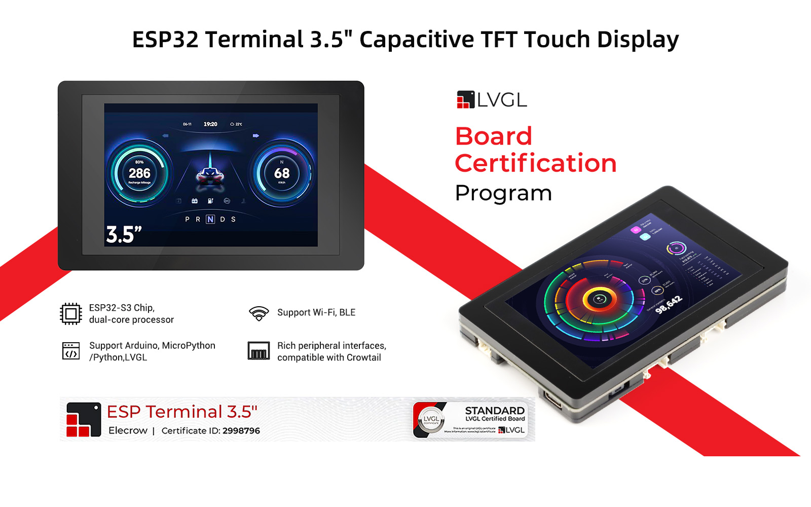
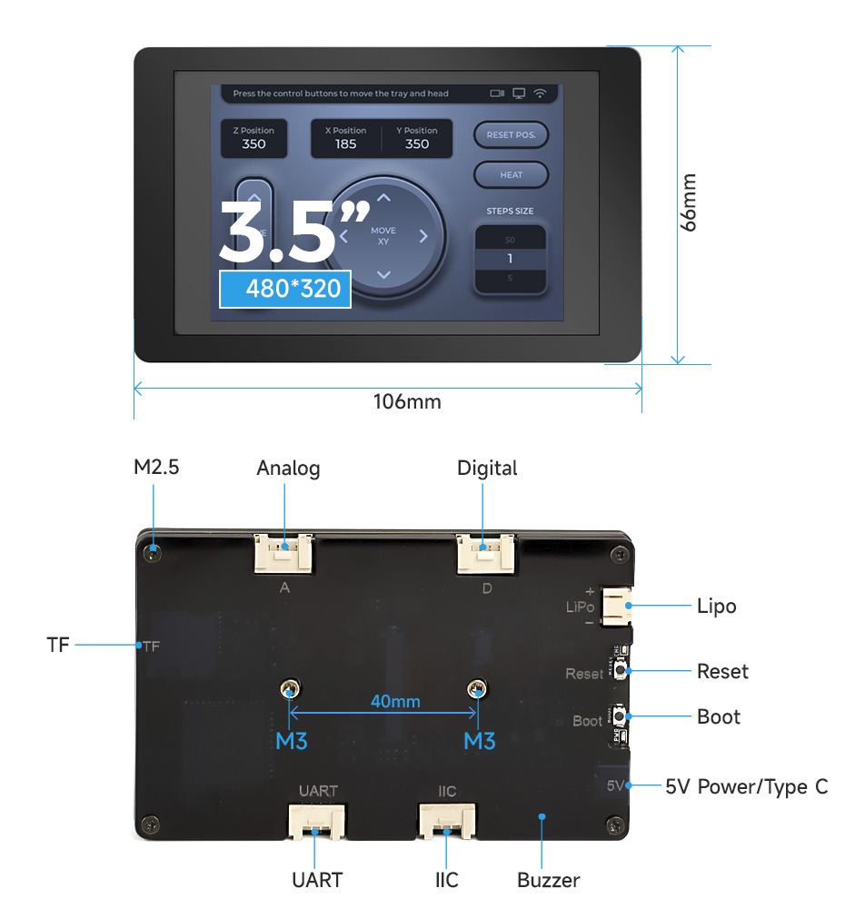

# crowpanel_esp32s3_lvgl_basic

Basic projects to test Elecrow "CrowPanel ESP32 Terminal" with C++ and PlatformIO.

This device is a 3.5 inch parallel 480x320 TFT capacitive touch RGB display (RGB by chip ILI9488) based on ESP32-S3 core.

It supports LVGL graphics library and can be programmed with VS Code, Arduino IDE, Espressif ESP-IDF and PlatformIO.

The "crow-tail" connector is just the "HY2.0" connector family most commonly sold as "Grove" connectors.

You can use different kind of software tools to design the GUI of your application in your laptop, and export and auto-generated code for LVGL to be added to your peoject. Tools like [LVGL UI Editor](https://github.com/lvgl/lvgl_editor), [EEZ Studio](https://github.com/eez-open/studio), ["SquareLine Studio"](https://vision.squareline.io/), etc.

## Description

This CrowPanel ESP32 terminal is a microcontroller based on the ESP32 master. It adopts Xtensa 32-bit LX7 dual-core processor with a main frequency of up to 240Mhz, supports 2.4GHz Wi-Fi and BLE, and can easily handle common edge terminal device application scenarios, such as industrial control, agricultural production environment detection and processing, intelligent logistics monitoring, smart home scenarios and more.

This ESP32 module also has a 3.5-inch parallel RGB interface capacitive touch screen with a resolution of 480*320 to ensure perfect image output at a frame rate (FPS) of 60. On the back of this terminal, we have introduced 4 Crowtail interfaces, which can be used with our Crowtail series sensors, plug and play, and create more interesting projects quickly and conveniently. In addition, it is also equipped with an SD card slot for extended storage (SPI leads) and a buzzer function. This ESP32 touchscreen supports ESP-IDF and Arduino IDE development and is compatible with Micropython/Arduino. It also supports LVGL, which is the most popular free and open-source embedded graphics library to create beautiful UIs for any MCU, MPU, and display type. Now it has also obtained the official certification of LVGL. LVGL's board certificate shows that the boards can be easily used with LVGL and has decent performance for UI applications.  We also support openHASP. The onboard charging circuit and lithium battery interface can use the type-c power supply interface to supply power and charge the battery at the same time, providing more outdoor scene expansion possibilities.

This ESP32 terminal uses an acrylic shell, which can not only protects the screen but also makes it more beautiful. The size is only pocket size, small and portable; two M3 fixing holes are easy to fix, making it easier for you to set up your project.

## Features

- Integrated ESP32-S3 module, which supports 2.4 GHz Wi-Fi and BLE
- LCD 3.5 inches parallel TFT-LCD with 480*320 resolution
- Compatible with Arduino/LVGL/PlatformIO/Micropython
- Mature software support, support ESP-IDF and Arduino IDE development
- Support open-source Graphics Library-LVGL
- Support 1T1R mode, data rate up to 150 Mbps, Wireless Multimedia (WMM)
- Perfect security mechanism, support AES-128/256, Hash, RSA, HMAC, digital signatures and secure boot
- Onboard charging chip and interface, use TYPE-C interface to charge
- With 4 Crowtail interfaces (HY2.0-4P connector), plug and play with various Crowtail sensor.

## Specification

- ESP32-S3 module with 16MB Flash and 8 MB PSRAM
- Wi-Fi Protocol: 802.11b/g/n (802.11n up to 150Mbps) Wi-Fi Frequency Range: 2.402GHz - 2.483Ghz
- Support BLE 5
- With 4 Crowtail interfaces (HY2.0-4P connector) and onboard Micro TF card slot
- 3.5-inch TFT LCD RGB true color LCD screen with 480*320 resolution
- Driver chip: ILI9488 (16-bit parallel line)
- Capacitive touch panel controller IC FT6236 series
- LiPo Battery Interface: PH2.0
- Operating temperature: -10°C ~ 65°C
- Active Area: 73.63(L)*49.79mm(W)
- Appearance Dimensions: 106(L)x66mm(W)*13mm(H)
- OperatingVoltage: DC 5V-500mA
- Sleep current:
  - USB power supply: 6.86mA
  - Lithium battery power supply: 3.23mA

## Price & SKU

- $28.90
- SKU DLC35010R

## Wiki & Documents

- [Buy](https://www.elecrow.com/esp-terminal-with-esp32-3-5-inch-parallel-480x320-tft-capacitive-touch-display-rgb-by-chip-ili9488.html)
- [User Manual](https://www.elecrow.com/download/product/DLC35010R/ESP32_Terminal_RGB_User_Manual.pdf)
- [Wiki](https://www.elecrow.com/wiki/esp-terminal-with-35inch-rgb-capacitive-touch-display.html)
- [Tutorials](https://www.elecrow.com/wiki/Tutorials.html)
- [Schematic Diagram](https://www.elecrow.com/download/product/DLC35010R/ESP32-3.5_TFT_Display(RGB)-V1.0_Eaglefile.zip)
- [ILI9488 Datasheet](https://www.elecrow.com/download/product/DLC35010R/ILI9488_Data_Sheet_100.pdf)
- [ESP32-S3 Datasheet](https://www.elecrow.com/download/product/DLC35010R/esp32-s3_datasheet_en.pdf)
- [LVGL Reference](https://www.elecrow.com/download/product/DLC35010R/LVGL_Library.pdf)
- [openHASP Github](https://github.com/HASwitchPlate/openHASP)
