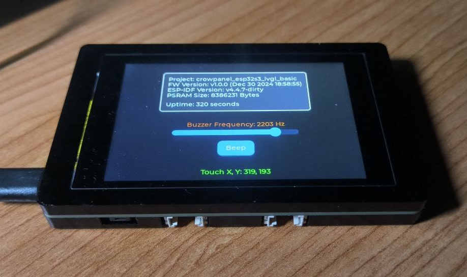

# crowpanel_esp32s3_lvgl_basic

Basic project to test Elecrow "CrowPanel ESP32 Terminal" with C++ and PlatformIO using Arduino framework.

This project uses LVGL graphics library to show some device information on it and draw a slidebar and a button to configure device buzzer frequency and test beep sounds on it.
